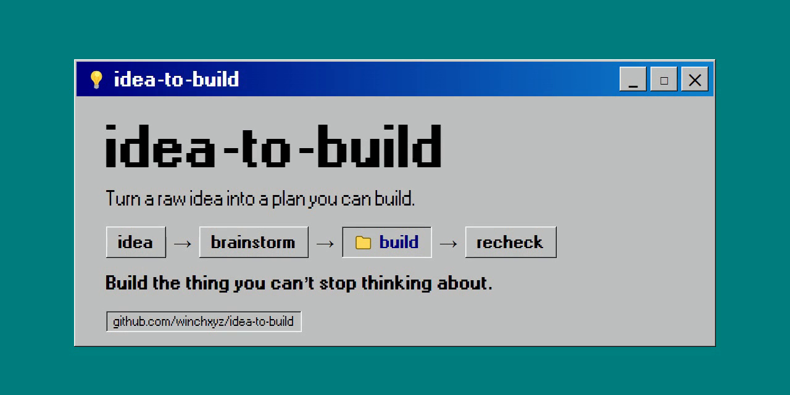

<div align="center">



# idea-to-build

**A quality, structured brainstorm that takes a raw idea all the way to something you can build — for founders, builders, and creators.**

The point is the brainstorm itself: it researches your idea, argues with it, fact-checks it, makes you weigh real alternatives, and won't let you skip the hard parts — then `/scaffold` hands the whole thing to Claude Code as a folder you build from. A rigorous brainstorm, and a real handoff to the build.

[](https://opensource.org/licenses/MIT)
[](https://claude.com)
[](CONTRIBUTING.md)
[](CHANGELOG.md)

[Quick Start](#-quick-start) • [See It in Action](#-see-it-in-action) • [How It Works](#-how-it-works) • [Using It](#-using-it) • [Profiles](#-profiles) • [Why This](#-why-this-vs-alternatives) • [Contribute](CONTRIBUTING.md)

</div>

---

## The Problem

Brainstorming with an LLM is shallow — and it dead-ends. You get an enthusiastic wall of text, and then nothing you can actually build from.

Ask any LLM — Claude, ChatGPT, Gemini, Grok — to brainstorm and you hit the same failure modes:
- ❌ Agreement, not pushback — it tells you why your idea is brilliant, not why it'll fail
- ❌ Fabricated market sizes and made-up statistics
- ❌ Generic SWOT lists that fit any business
- ❌ "5 great ideas!" — none of which are actually different
- ❌ No memory across sessions — you re-explain context every time
- ❌ And even a *good* brainstorm ends in a chat you have to translate into a plan, then into a build, by hand
- ❌ And once you *are* building, nothing keeps you honest — you tunnel, and end up optimizing the parameters of a thesis that was never going to work

This tool fixes those — it closes the loop to a build, and keeps you honest while you build it. The full version runs on Claude (Cowork, Claude Code, or the Claude CLI); a degraded standalone prompt (`distributions/standalone-prompts/lite.md`) works in any other LLM.

## The Solution

**A structured 6-phase brainstorm that takes a raw idea all the way to something you can build.** Understand → Context → Generate → Deep Dive → Critique → Plan — each phase does the work most chats skip: real research with sources, genuinely different options, a ruthless critique that won't let you skip the premortem, and a plan with go/no-go gates.

Then the part that makes it *idea-to-build*: when the brainstorm is done, **`/scaffold` turns the whole thing into a folder you open in Claude Code and build from** — the chosen approach, the paths you rejected, the risks to watch, the gates. Idea in, buildable plan out. And when real results come in, **`/recheck`** re-critiques the project so you don't tunnel — *is the thesis failing, or just the tuning?*

> "It found a flaw in my pivot that I'd been missing for three weeks." — early tester

---

## 👀 See It in Action

https://github.com/user-attachments/assets/6937a64e-1d7f-4b15-b1e2-4a28ddb1232f

Real sessions, each linked in full — strongest first. Most put one prompt through a normal chat vs. the methodology, side by side; one runs a single idea through six profiles; the first is a complete start-to-finish run that ends in a buildable plan:

- [**Full run: medieval tycoon game**](examples/medieval-tycoon-fullrun.md) — the whole method, Phase 1 → 6 → `/scaffold`. A vague "tycoon game" comes out scoped, critiqued (GO with conditions), planned with a kill-switch, and handed off as a buildable folder. **Start here — it's the idea→build arc end to end.**
- [**Hyperliquid wallet**](examples/hyperliquid-wallet-comparison.md) — the deepest comparison: the full method through a trace-verified Phase-5 critique. Read this to see the rigor.
- [**Personal health AI**](examples/health-system-comparison.md) — the harder case: plain Claude was already competent, and the methodology still added strategy (beachhead, regulatory risk, an architectural blocker).
- [**Profiles in action**](examples/profiles-comparison.md) — the *same* idea run through six profiles, showing how each asks different questions. Proof the profiles aren't cosmetic.
- [**Food delivery app**](examples/food-delivery-comparison.md) — the "can it say no?" test (trace-verified): the critique returns NO-GO on the head-on idea, then GO-with-conditions on the pivot.
- [**AI support agent**](examples/ai-support-agent-comparison.md) — another honest NO-GO: the methodology pushes back and recommends *not* building the idea.
- [**Stickman game**](examples/stickman-comparison.md) — the simplest contrast: plain Claude builds instantly, the methodology stops to scope. A quick way to see the difference.

---

## 🚀 Quick Start

Four install paths — all available.

### ✅ Option 1: Plugin via marketplace — Claude CLI (terminal)
In a terminal, run `claude`, then:
```bash
/plugin marketplace add winchxyz/idea-to-build
/plugin install idea-to-build@idea-to-build
```
Then `/idea-to-build:start` to activate the coordinator. All eleven commands are namespaced `/idea-to-build:*` (e.g. `/idea-to-build:critique`, `/idea-to-build:scaffold`, `/idea-to-build:recheck`). The `/plugin …` commands run in the Claude CLI; once installed, the `/idea-to-build:*` commands work in your CLI sessions. Verified working.

### ✅ Option 2: Plugin via marketplace — Cowork / Claude Code (desktop app)
In the Claude desktop app (Cowork or Claude Code — one shared environment): **Customize → Personal plugins → `+` → Create plugin → Add marketplace**, enter `winchxyz/idea-to-build`, hit **Sync**, install the plugin, then run `/idea-to-build:start`. Once installed this way, the `/idea-to-build:*` commands work across both Cowork and Claude Code.

> **If Cowork's marketplace lags or won't update** — a known Cowork plugin-update bug where the *Update* button stays greyed out and re-adding reuses a stale cache — install it manually instead: download **`idea-to-build-plugin.zip`** from the [latest release](https://github.com/winchxyz/idea-to-build/releases/latest), then **Customize → Personal plugins → `+` → Create plugin → Upload plugin** and pick the zip. It lands under **My Uploads** and works identically.

### ✅ Option 3: Clone the repo (open in the desktop app or the Claude CLI)
```bash
git clone https://github.com/winchxyz/idea-to-build.git
```
Open the cloned folder. The root [`CLAUDE.md`](CLAUDE.md) bootstraps the coordinator automatically (no `/start` needed); the repo's `.claude/skills/` provide the `/`-commands in Claude Code and the Claude CLI.

### ✅ Option 4: Standalone prompt — any LLM
Copy [`distributions/standalone-prompts/lite.md`](distributions/standalone-prompts/lite.md) into ChatGPT, Claude, Gemini, or any chat. Degraded quality (no isolated planner, no cross-session memory, no `/scaffold`, no `/recheck`), but zero setup.

---

## 🧩 How It Works

It starts by asking what kind of project this is — a preset that sets the lens and the *flow shape* (which phases run full, light, or skipped) — then guides you through six phases and won't let you skip the ones that hurt. The critique is a ruthless, structured pass (forced premortem, steelman, inversion, a real verdict that separates the *thesis* from the *parameters*); the planner produces a gated plan with a kill-switch. `/scaffold` turns the whole brainstorm into a folder Claude Code builds from, and `/recheck` re-critiques it once real results are in.

```
┌────────────────────────────────────────────────────────────────┐
│                    Coordinator (you talk to)                   │
│                                                                │
│  Preset ─ "what kind of project?"  → lens + flow shape         │
│                                                                │
│  Phase 1 ─ Understanding   "What are you actually trying to    │
│                             accomplish?"                       │
│  Phase 2 ─ Context         🔍 Research Agent (optional)        │
│  Phase 3 ─ Generation      💡 Ideation Agent (optional)        │
│  Phase 4 ─ Deep Dive       🔬 Deep-Dive Agent (optional)       │
│  Phase 5 ─ Critique        ⚔️  In-context, adversarial        │
│                             Sees: everything — stays harsh     │
│                             Forced: premortem + steelman,      │
│                             thesis vs. parameters              │
│  Phase 6 ─ Plan            📋 Planner Sub-Agent  ◄── isolated │
│                             Sees: choice + critique            │
│                             Forced: actionable steps + gates   │
├────────────────────────────────────────────────────────────────┤
│  /scaffold ───────────────▶ 📦 Scaffolder → buildable folder   │
│                             (CLAUDE.md · README · DECISIONS ·   │
│                              PLAN) → open in Claude Code, build │
│                                                                │
│  /recheck  ◀── real results  "thesis failing, or just tuning?" │
└────────────────────────────────────────────────────────────────┘
```

**Why this works:** Most "brainstorms" fail because the model skips the hard parts and then leaves you with a transcript. idea-to-build forces the hard parts — a structured premortem and steelman you can't skip, fact-checking with confidence labels, and a verdict that's allowed to be NO-GO — then hands the result to a build via `/scaffold`. The forced structure is the lever; the build handoff is the point.

And it doesn't abandon you at the handoff. Once you have real results, **`/recheck`** re-critiques the project — *is the thesis failing, or just the tuning?* — so you don't spend weeks optimizing the parameters of an idea that was never going to work. The scaffolded folder carries that same discipline into the build, so the building agent thinks wide instead of tunneling.

---

## 📖 Using It

Different situations, different moves — the full [**Usage Guide**](docs/GUIDE.md) walks each one step by step:

- **A brand-new idea** → the full arc (preset → 6 phases → `/scaffold` → build → `/recheck`)
- **A project you're already building** → `/recheck` it with real results (is the thesis failing, or just the tuning?)
- **A change to an existing project** → a brainstorm scoped to the decision
- **Not sure which lens fits** → a profile picker that maps what you're doing to the right preset

→ [**Read the guide**](docs/GUIDE.md)

---

## 📚 Profiles

idea-to-build ships with **8 modes**: one general-purpose base plus seven domain specializations.

| Profile | When to use | Key tools |
|---------|-------------|-----------|
| 🎯 [General](profiles/general.md) | Any idea, any domain (calibrates to nature) | Full 6-phase framework |
| 🚀 [Startup](profiles/startup.md) | Founder ideating a product/business | Unit economics, GTM, JTBD, Beachhead |
| 🛠️ [Personal Project](profiles/personal-project.md) | A tool/app/game you're building for yourself | Build-vs-reuse, MVP, YAGNI, abandonment premortem |
| 🔭 [Exploration](profiles/exploration.md) | Thinking a topic through; no build intended | First-principles, steelman, second-order effects |
| ⚙️ [Tech Architecture](profiles/tech-architecture.md) | System design, stack choices | Trade-off matrices, RFC structure |
| 🎬 [Content Strategy](profiles/content-strategy.md) | Channel, niche, monetization | Audience-fit, virality patterns, RPM |
| 🗺️ [Product Roadmap](profiles/product-roadmap.md) | Feature prioritization, GTM | ICE/RICE, Kano, North Star Metric |
| 🧭 [Personal Decisions](profiles/personal-decisions.md) | Career moves, life transitions | Reversibility, Expected Value, Inversion |

A preset is chosen at the start of every session (or auto-classified from your description); it sets the lens **and** the flow shape — which phases run full, light, or skipped. Profiles override defaults inside each phase. Switch any time with `/profile startup` — a real slash command in Claude Code and the Claude CLI; in Cowork, just say it in plain language ("switch to the startup profile"). See six compared on one idea: [`profiles-comparison.md`](examples/profiles-comparison.md).

---

## 🆚 Why This vs Alternatives

| | Raw ChatGPT/Claude | Awesome-prompts repo | LangChain/CrewAI build | **idea-to-build** |
|---|---|---|---|---|
| Setup time | 0 sec | 30 sec | 30+ min | ✅ 60 sec |
| Forced critique | ❌ | ⚠️ Often skipped | ✅ if coded | ✅ Hard-gated |
| Fact-checking discipline | ❌ Hallucinates | ❌ No enforcement | ⚠️ DIY | ✅ Tier 1/2/3 protocol |
| Cross-session memory | ❌ | ❌ | ✅ if coded | ✅ Context files |
| Isolated planner | ❌ | ❌ | ✅ if coded | ✅ Fresh-context sub-agent |
| Domain profiles | ❌ One-size | ❌ | ⚠️ DIY | ✅ 8 ready + auto-preset |
| Ends in a buildable plan | ❌ Just a chat | ❌ | ⚠️ DIY | ✅ `/scaffold` → folder Claude Code builds |
| Honest during the build | ❌ | ❌ | ⚠️ DIY | ✅ `/recheck` re-critique loop |
| Cost per brainstorm | Free–$1 | Free | $$ (LLM API) | Free (your Claude subscription) |

More questions — *is it really multi-agent? could a prompt do this? does it actually say no?* — see the [**FAQ**](docs/FAQ.md).

---

## 🎯 Core Principles

1. **Skeptical by default.** Every claim — yours, the user's, the source's — is a hypothesis to be tested. Accuracy over confidence, clarity over speed, evidence over assumption. When uncertain, the tool tells you exactly what would verify the claim.
2. **Phase-explicit communication.** Coordinator announces the current phase in every message. No silent transitions.
3. **Factual rigor (Tier 1/2/3).** Made-up numbers are a sin. Each material claim gets a ✅ / ⚠️ / 🔍 confidence label.
4. **Calibrated recommendations.** Every recommendation includes a confidence percentage, what would raise/lower it, and an alternative if confidence drops. No false certainty.
5. **Forced critique.** Phase 5 cannot be skipped. Premortem + What-Needs-to-Be-True are mandatory.
6. **Adversarial critique.** A dedicated critic pass forced to premortem, steelman, and invert — built to find the flaw you're too attached to see, and to return an honest GO / NO-GO. It separates the *thesis* from the *parameters*, so you don't later optimize a premise that was never true.
7. **Memory as a log, not state.** Decisions and rejected options are appended, never overwritten. History matters.
8. **Ends in a build, not just a brainstorm.** The point isn't a tidy writeup — it's a scoped, critiqued plan you can act on. `/scaffold` turns the finished brainstorm into a folder Claude Code builds from.
9. **Honest past the plan.** The deadliest failures happen during execution, not the brainstorm — a project quietly optimizes the *parameters* of a *thesis that was never true*. `/recheck` re-critiques a built project against real results (*is the thesis failing, or just the tuning?*), and the scaffolded folder carries the same anti-tunnel-vision discipline into the build.

Full methodology: [`docs/METHODOLOGY.md`](docs/METHODOLOGY.md)

---

## 🏗️ Architecture

```
idea-to-build/
├── CLAUDE.md                 # Entry point — auto-activates the coordinator
├── .claude/skills/           # Slash commands for Claude Code and the Claude CLI (/profile, /critique…)
├── .claude-plugin/           # Marketplace manifest (Add marketplace / /plugin install)
├── core/
│   ├── CLAUDE.md             # Full coordinator specification
│   ├── agents/               # 6 agents: research, ideation, deep-dive, critic, planner, scaffolder
│   ├── skills/               # Recommendation + confidence module
│   └── templates/            # Project context file template
├── profiles/                 # 8 domain profiles (general + 7 specialized)
├── distributions/
│   ├── claude-code-plugin/   # Installable plugin — 11 commands + 6 agents (Cowork / Claude CLI)
│   └── standalone-prompts/   # Lite version for any LLM
├── docs/
│   ├── GUIDE.md              # Usage guide — scenarios + profile picker
│   ├── ARCHITECTURE.md       # How sub-agents are orchestrated
│   ├── METHODOLOGY.md        # Core principles in depth
│   ├── PHASES.md             # 6 phases explained
│   ├── PROFILES.md           # Profile authoring guide
│   └── FAQ.md                # Common questions, answered honestly
└── examples/                 # Template, guide + real comparison transcripts
```

> The `examples/` directory ships with a template, an authoring guide, and seven real transcripts — five run the same prompt as plain Claude vs. through the methodology: a stickman game, a personal-health-AI startup, a Hyperliquid wallet (full methodology through a trace-verified Phase 5 critique → NO-GO), an AI support agent, and a food-delivery app (where the Phase 5 critique returns NO-GO on the head-on idea, then GO-with-conditions on the pivot) — plus a profiles comparison (one idea, six profiles) and a full start-to-finish run that ends in a buildable plan. See [`CHANGELOG.md`](CHANGELOG.md) for what's new.

Full architecture: [`docs/ARCHITECTURE.md`](docs/ARCHITECTURE.md)

---

## 🤝 Contributing

We welcome:
- 🆕 New profiles for specific domains (legal, healthcare, education, climate, etc.)
- 🛠️ Improvements to sub-agent prompts
- 📖 Real-world brainstorm transcripts for `examples/`
- 🌍 Translations (currently English-first; methodology language-agnostic)
- 🐛 Bug reports and edge cases

See [`CONTRIBUTING.md`](CONTRIBUTING.md).

---

## 📜 License

MIT — see [`LICENSE`](LICENSE). Use it, fork it, ship it commercially. Just don't sue us if your brainstorm convinces you to do something dumb.

---

## ⭐ Star History

If `idea-to-build` helped you avoid a bad decision (or commit to a good one), a star makes our day.

[](https://star-history.com/#winchxyz/idea-to-build&Date)

---

<div align="center">
Built with 🧠 by people who got tired of LLMs agreeing with them.
</div>
